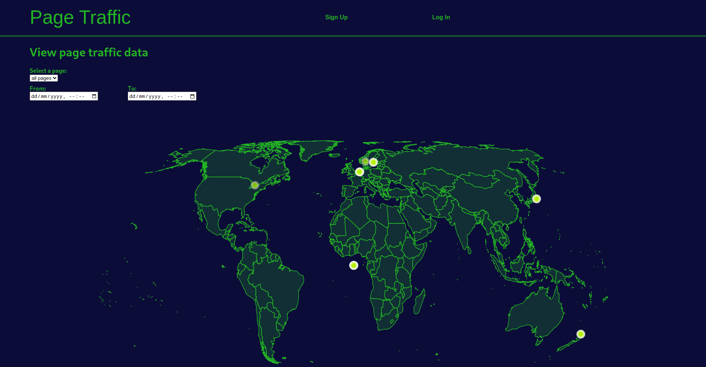
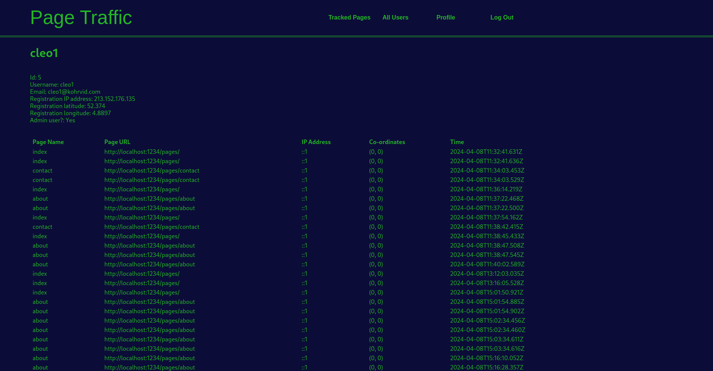

# traffic_frontend

This is the frontend repo for the Page Traffic application

<!-- vim-markdown-toc GFM -->

* [Requirements](#requirements)
* [Development](#development)
* [About](#about)
  * [WorldMap](#worldmap)

<!-- vim-markdown-toc -->

## Requirements

* NodeJS 21+ (This application was created with v21.7.1 using
  [asdf](https://asdf-vm.com/))
* NextJS (`npm install -g --registry=https://registry.npmjs.org next`)
* [ngrok](https://ngrok.com/download)

## Development

Install dependencies:

    npm install

In order to run the app locally, the `.env` file (or a new
`.env.local` file) must be configured with the missing environment
variables. Then run the server with the following:

    npm run dev

The app should then appear in http://localhost:1234 however, the app will be
unable to collect a user's IP address. An ngrok tunnel must be run in order to
use the app in the development environment:

    ngrok http 1234

Run linting:

    npm run lint

To build this locally:

    npm run build
    npm run start

## About

This application will act as the UI for the Page Traffic application which
models visits to pages with tracking enabled. The frontend will make requests
to a separate [backend application](https://github.com/kohrVid/traffic_backend)
before displaying data in the UI.

Below are some screenshots of how the application looks in the dev environment:

The application is written in React with NextJS. I've decided to use NextJS in
a number of my personal projects because I've found that it fails in a more
predictable manner than its rival ViteJS (issues with types in a Typescript
dependency for example may make it to deployment in ViteJS-SSR but then fail to
render in the browser whereas with NextJS, typically the app won't build when
it encounters problems like this). I have my reservations about both however
(particularly the telemetry that NextJS uses by default). The use of NextJS
means that SSR is provided out of the box, a feature that is good for search
engines and screenreaders that would otherwise struggle to read Javascript
webpages.

A number of the components used here are quite similar to other components I've
used in personal apps. I had considered using MaterialUI for things like a grid
system or various inputs but decided against it as I don't have as much
experience using that library.

### WorldMap

The UI mostly revolves around the `WorldMap` component, in part because there
wasn't time to add the histograms that I'd initially planned. I found D3.js too
challenging to learn in the alloted time and so chose to use a simpler library
that was based on it to create the map. Unfortunately the new library
((react-simple-maps)[https://github.com/zcreativelabs/react-simple-maps]) also
turned out to be a nightmare because its dependencies kept forcing the library
to compile into CommonJS (as opposed to ES Modules). In the end, I had to [fork
the project](https://github.com/kohrVid/react-simple-maps), update and refactor
a significant amount of the library before including it in my project.
